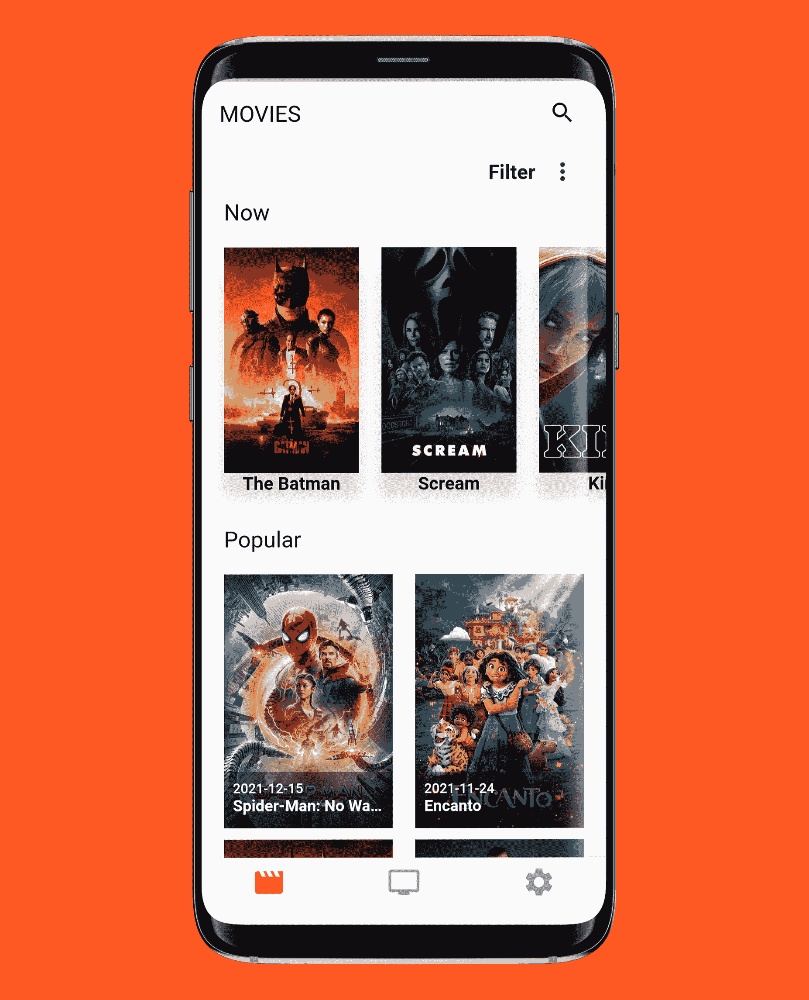
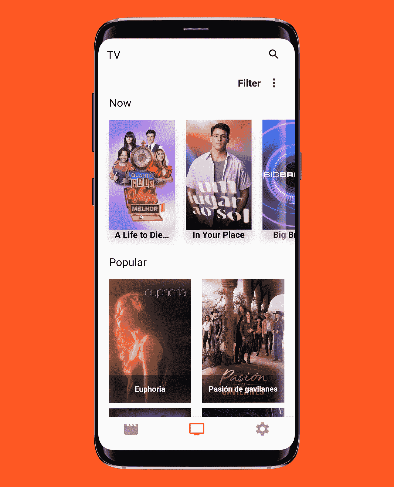
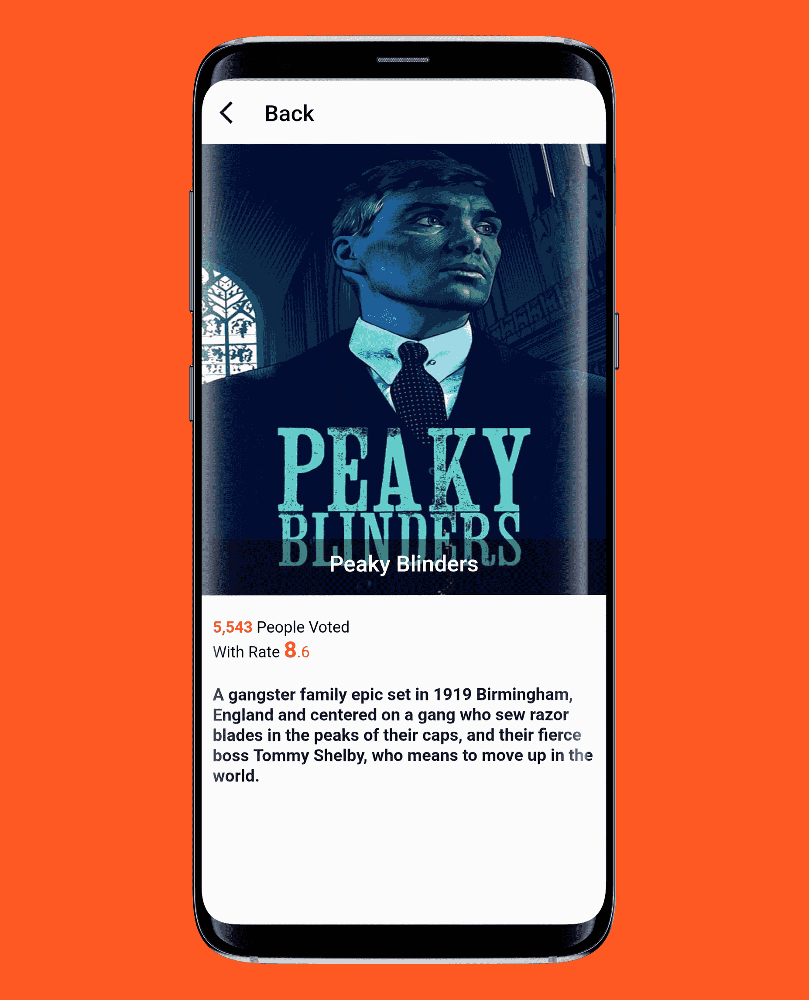
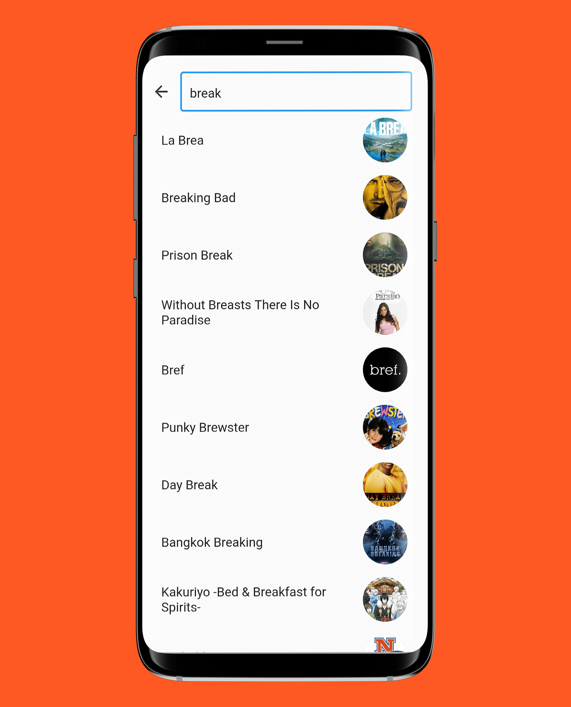
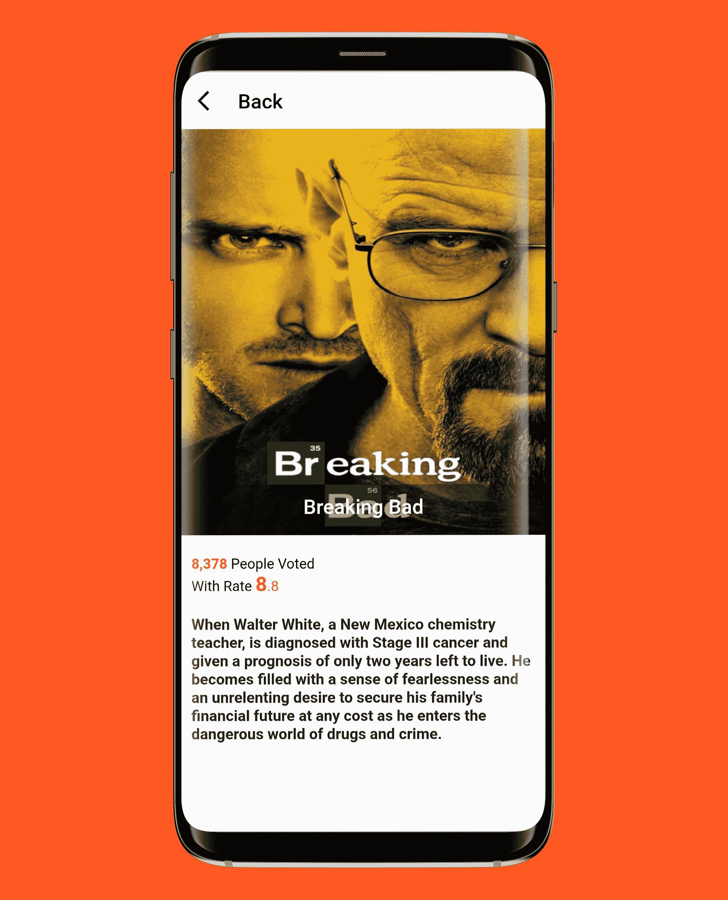
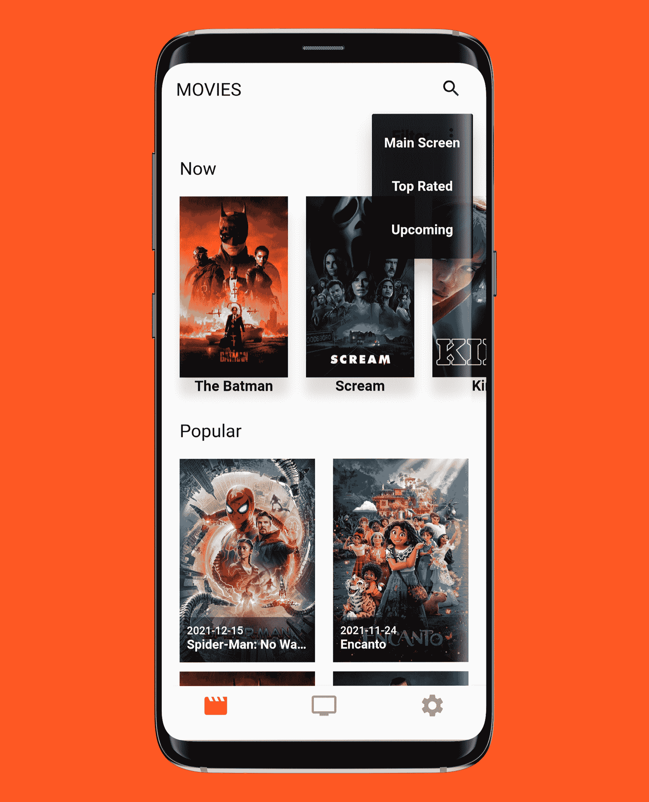
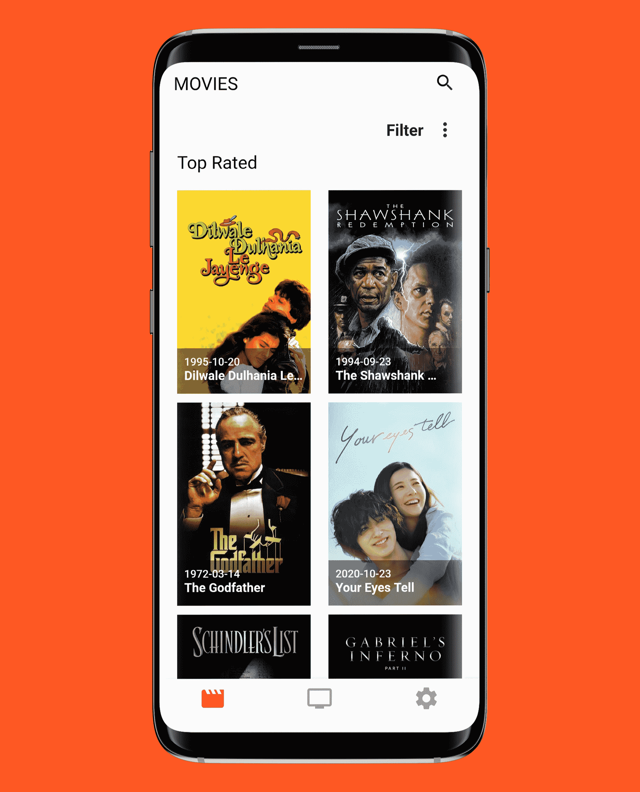

# Movies_Tv_App
This App allows you to follow the news about movies and tv shows.
This App is written in CLEAN ARCHITECTURE way.

# Features
- User has the ability to know the movies and tv shows that are 
  -- Playing Now 
  -- Popular
  -- Top Rated
  -- Upcoming
- User can search for a movies or a show.
- Bloc statemanagement

# Screenshots

    
    
    
    
    
    
     

## Getting Started

This project is a starting point for a Flutter application.

A few resources to get you started if this is your first Flutter project:

- [Lab: Write your first Flutter app](https://flutter.dev/docs/get-started/codelab)
- [Cookbook: Useful Flutter samples](https://flutter.dev/docs/cookbook)

For help getting started with Flutter, view our
[online documentation](https://flutter.dev/docs), which offers tutorials,
samples, guidance on mobile development, and a full API reference.
